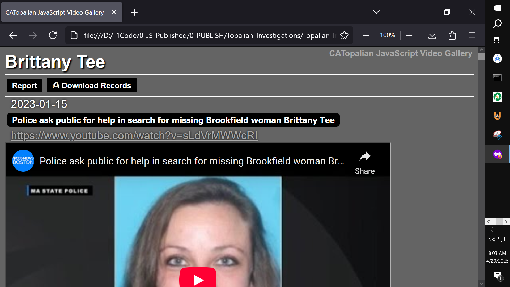

# CATopalian JavaScript Video Gallery
A JavaScript application that displays videos from an array of objects in an orderly column with video data included.  

USE APP: https://christopherandrewtopalian.github.io/CATopalian_JavaScript_Video_Gallery/CATopalian_JavaScript_Video_Gallery.html  

---

### How to Download this App
1. Click the green Code Button on this github page
2. Choose Download ZIP
3. Save the Zip File
4. Extract All
5. Double click the HTML file to start the App

---

Happy Scripting :-)

